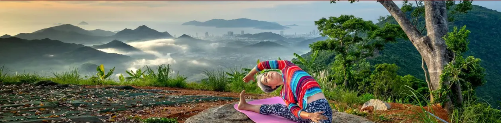

# **The seven chakras**

## **Site overview**

The seven chakras is a website that informs people about the seven energy centers in the human body named as seven chakras. The seven chakras, also known as wheels, align along the central axis of the body from the crown of the head to the base of the spine. It helps users understand which chakra is responsbile for which energy center and explains the methods to make the energy flow again by balancing the chakras.  

  

### **Target audience**

* Users who practice yoga or meditation.
* Users who feel low in energy and want to know how to balance it.
* Users who are generally interested in the concepts of chakras and the beliefs of ancients.

## **Themes**

### **Color scheme**

* For the background I used a subtle color, with the aim to keep the appearance relaxing. As this is a website for energy centers and medidation I did not want go for something overwhelming.
* For the top header I used a meroon shade with a same color shadow appearing on the top of the footer and bottom of the navigation to keep the consistency.
* For the navigation I have chose a black color with white text. This color went well with the overall design of the website. Repeatedly for the consistency a meroon color is chosen for the hover(slightly transparant) and on active.
* On the seven chakras page a slightly transparant tone has been used that relates to the color of the chakras to make to page look visually attractive to the users.  

The colors are checked using color grid:  

https://contrast-grid.eightshapes.com/?version=1.1.0&background-colors=&foreground-colors=%23FFEFD5%0D%0A%236C1313%0D%0A%23FAEBD7%0D%0A%23000000%0D%0A%23985D5D%0D%0A%23FF0000%0D%0A%23008000%0D%0A%23ff000033%0D%0A&es-color-form__tile-size=regular&es-color-form__show-contrast=aaa&es-color-form__show-contrast=aa&es-color-form__show-contrast=aa18&es-color-form__show-contrast=dnp  

  

### **Typography**

The fonts were sourced from Google Fonts. Also, I used Fontjoy to find a suitable font for all pages. I ended up chosing three fonts which complimented each other well and kept the readability well.

* Montserat: for the title h1 and navigation.
* Lora: for all subheadings h2-h4.
* Hind Madurai: for all other texts/paragraphs.  

  

### **Typography**
* All icons were imported from FontAwesome. https://fontawesome.com/  
* Icons were used throughout the project. The usage is described for every page seperately in this document.

## **Approach**

Mobile first approach has been used in this project with the reason: It is easier to get element from a small device fit on a larger device. Media queries have been used to override the code for larger devices such as tablets, laptops desktops. I have taken care of screen sizes starting from 300px to above. If its get above 1400px then the content is centered and still visible on the screen. 

## **Generic features - on all pages**

### **Header**

Each page consists of a header with three elements: a title, navigation and a hero image.

#### **Title**

* The title serves as the main name of the website, which is self explanatory: "The seven chakras".
* The title is clickable and brings the user from every page back to the about page.
* For the title the Font-family Montserat is used. For me this heading had a simple yet powerful look. This was also the top of the typography theme which I mentioned in the section before.

  

#### **Navigation**

* The navigation consists of four tabs: About, Seven chakras, Balancing and contact. 
* Each tab is descriptive to the page content. 
* The selected page has a meroon color.
* When hovered over the navigation tabs a partly meroon color is visible.
* The navigation has two styles - for smaller screen it is a hamburger menu with a vertical list. The list items can be seen using the hamburger menu. 
* The hamburger menu is set to do not display on larger screens. Instead the list items are shown vertically and are always visible on the screen. 

  

#### **Hero image**

* Hero image to make the the page visually attractive. 
* Except making the website look better visually these images dont serve any motive.
* The images are chosen based on the content that I found suitable and attractive. The choices are described in the individual page features.

### **Main**

The main section covers most of the space. By using a flex in the property the footer is pushed down at the end of the page. A in depth description of the content of each page can read in the sections below.

### **Footer**

* The footer consists of a social media network. 
* Upon clicking on one of the icons the user is navigated in a new page to the designated network.
* The icons are horizontally aligned and the space in between is evenly spread. Because of this reason the footer was automatically responsive to all sizes.

## **Individual page features**

### **About**

* The index page of the website.
* It gives a description of what chakras are and where it orignally came from.
* The text is descriptive, straight to the point and the structure is kept simple and readable. 
* The colors and the fonts have a great accesibility.

..

  

### **Hero image**
*   About: A sitting person in yoga posture with smaller chakra images showing on top of it. These are placed according to where the chakra is located. This gives a good overview of chakras. Also,the image colors, mainly black and yellow, go well with the website theme, therefore this image gives a good presence to the index/about page.

  

### **Seven chakras**

* Description of all seven chakras with all elements sorted in a table.
* The table is horizontally aligned. If the size goes below 400px the table will be shows vertically.
* Colors of the chakras, which also match the hero image of this page, are chosen to style the information to create a recurring effect and an impact for the user to understand and remember the informtation visually.
* Mantras have been used for each of the seven chakras. H4 header has been used for the mantra in the serif and cursive style to mark the quotation.

#### **Hero image**
* Seven chakras: Personally, this image was very appealing to me because of the colors. There is a bit of a yellow shade in the form of chakra coming from the back, which gave me the vibe of energy and power. The yellow color goes well with the theme. Further on this image 7 persons can be seen in the same yoga posture with different colors. Each chakra has its own color and each person represents one chakra. Throughout the page I have played with the same colors. 

  

### **Balancing chakras**

#### **Hero image**

* Balancing: For this hero image my motivation came from the techniques for balancing which are mentioned on the this page. I tried to find a good combination of the techniques and I came across an image of a person doing yoga in nature. I was not able to capture all eight in a picture, but this covered quite a few techniques: nature, yoga, meditation, breathing. The green color in the image gave a boost to the overal subtle contrast of the theme. Also, the picture had a very high quality which went very well. 

  

### **Contact**

#### **Hero image**
* Contact: For this one, as the final page on the website, I wanted to go for a relaxing yet subtle image complimenting the look and feel of the website. The colors went well with the website and it acomplished my search for a calm and subtle image. 

  

### **Contact feedback**

#### **Hero image**

* Contact feedback: The same image as the contact page has been chosen for this one. As the proces remains the same I wanted to keep the same image.