# **The seven chakras**

## **Site overview**

The seven chakras is a website that informs people about the seven energy centers in the human body named as seven chakras. The seven chakras, also known as wheels, align along the central axis of the body from the crown of the head to the base of the spine. It helps users understand which chakra is responsbile for which energy center and explains the methods to make the energy flow again by balancing the chakras.  

## **Planning phase**

### **Use case**

Often we hear people speaking about being low in energy. We have all experienced this and not always we have an answer on the reason why we feel a certain way. Going back to what the ancients have written and how the yogis have described the concepts of chakras related to energy centers, this website aims to give an answer on what the healing chakras are, it's history and what we can do to balance them.  

### **Requirements**

* As a user I want to get knowledge about chakras and its origins.  
* As a user I want a clear overview about the seven chakras and its elements.  
* As a user I want to know what I can do to increase the flow of my energy.  
* As a user I want to be able to contact if I have further questions.  
* As a user I want to be able to view the information on smaller and larger device sizes.  
* As a user I want to be able to navigate easily through the pages.  

### **Target audience**

* Users who practice yoga or meditation.
* Users who feel low in energy and want to know how to balance it.
* Users who are generally interested in the concepts of chakras and the beliefs of ancients.

### **Approach**

Mobile first approach has been used in this project with the reason: It is easier to get element from a small device fit on a larger device. Media queries have been used to override the code for larger devices such as tablets, laptops desktops. I have taken care of screen sizes starting from 300px to above. If it gets above 1400px then the content is centered and still visible on the screen. 

### **Responsiveness**

The website is responsive and tested for devices starting at 300px. All device sizes haven been taken into consideration.

  

### **Themes**

#### **Color scheme**

* For the background I used a subtle color, with the aim to keep the appearance relaxing. As this is a website for energy centers and medidation I did not want go for something overwhelming.
* For the top header I used a meroon shade with a same color shadow appearing on the top of the footer and bottom of the navigation to keep the consistency.
* For the navigation I have chose a black color with white text. This color went well with the overall design of the website. Repeatedly for the consistency a meroon color is chosen for the hover(slightly transparant) and on active.
* On the seven chakras page a slightly transparant of each chakra has been used to make to page look visually attractive to the users.  

The colors are checked using: [color grid](https://contrast-grid.eightshapes.com/?version=1.1.0&background-colors=&foreground-colors=%23FFEFD5%0D%0A%236C1313%0D%0A%23FAEBD7%0D%0A%23000000%0D%0A%23985D5D%0D%0A%23FF0000%0D%0A%23008000%0D%0A%23ff000033%0D%0A&es-color-form__tile-size=regular&es-color-form__show-contrast=aaa&es-color-form__show-contrast=aa&es-color-form__show-contrast=aa18&es-color-form__show-contrast=dnp)  

  

#### **Typography**

The fonts were sourced from [Google Fonts](https://fonts.google.com/). Also, I used [Fontjoy](https://fontjoy.com/)  to find a suitable font for all pages. I ended up chosing three fonts which complimented each other and kept the readability high.

* Montserat: for the title h1 and navigation.
* Lora: for all subheadings h2-h4.
* Hind Madurai: for all other texts/paragraphs.  

  

#### **Icons**

* All icons were imported from [FontAwesome](https://fontawesome.com/)  
* extension has been added below the footer of all pages.

## **Generic features - on all pages**

### **Header**

Each page consists of a header with three elements: a title, navigation and a hero image.

#### **Title**

* The title serves as the main name of the website, which is self explanatory: "The seven healing chakras".
* The title is clickable and brings the user from every page back to the about page.
* For the title the Font-family Montserat is used. For me this heading had a simple yet powerful look. This was also the top of the typography theme in Fontjoy as mentioned in the typography section.

  

#### **Navigation**

* The navigation consists of four tabs: About, Seven chakras, Balancing and contact. 
* Each tab is descriptive to the page content. 
* The selected page has a meroon color.
* When hovered over the navigation tabs a partly transparant meroon color is visible.
* The navigation has two styles - for smaller screen it is a hamburger menu with a vertical list. The list items can be opened using the hamburger menu. 
* The hamburger menu is set to do not display on larger screens. Instead the list items are shown vertically and are always visible on the screen. 

  

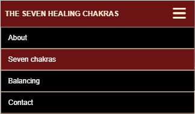  

#### **Hero image**

* Hero image to make the the page visually attractive. 
* Except from making the website look better visually these images dont serve any motive.
* The images are chosen based on the content that I found suitable and attractive. 
* Each hero image is explained in the section individual page features.

### **Main**

* The main section covers most of the space. 
* By using a flex in the property the footer is pushed down at the end of the page.
* All main sections have a padding on the left and on the right to avoid aligning close to the border and keeping the text in the focus point.  
* In depth description of the content of each page can be read in the section individual page features.

### **Footer**

* The footer consists of a social media network. 
* Upon clicking on one of the icons the user is navigated in a new page to the designated network.
* The icons are horizontally aligned and the space in between is evenly spread. Because of this reason the footer was automatically responsive to all sizes.

## **Individual page features**

In this section the main part elements and the hero image for each page can be read.

### **About**

* The index page of the website.
* The user can read a description of what chakras are and where it orignally came from.
* The text is descriptive, straight to the point and the structure is kept simple and readable.

The page images for both desktop and mobile can be seen below.

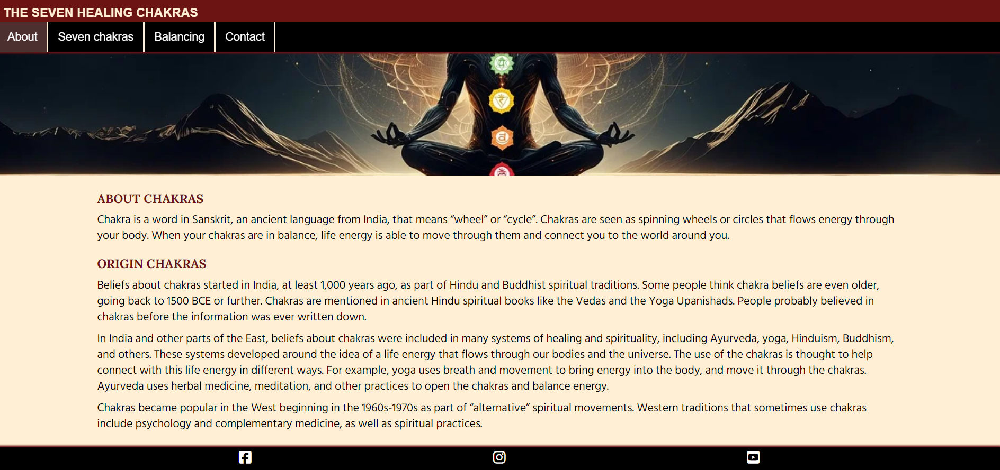  

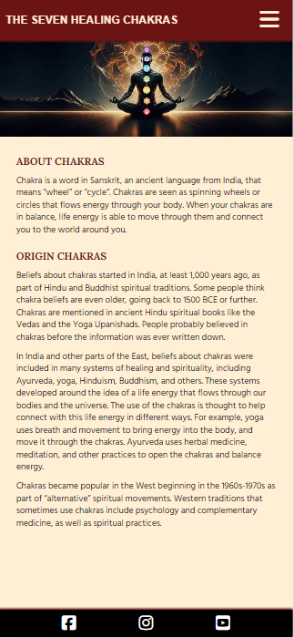  

#### **Hero image**

A sitting person in yoga posture with smaller chakra images showing on top of it. These are placed according to where the chakra is located. This gives a good overview of chakras. Also,the image colors, mainly black and yellow, go well with the website theme, therefore this image gives a good presence to the index/about page.

  

### **Seven chakras**

* The user can read about the seven chakras and its elements. The information is easy to understand and visually attractive.
* Description of the seven chakras sorted in seven sections.
* The elements are shown in a table. The table is horizontally aligned. If the size goes below 400px the table will be shows vertically.
* Mantras have been used for each of the seven chakras. H4 header has been used for the mantra in the serif and cursive style to mark it as a quotation. The quotation are taken from the website [Hands on Health](http://www.handsonhealthsheffield.com/health/the-seven-chakras-for-beginners/#:~:text=Root%20Chakra%20(Muladhara)&text=When%20the%20root%20chakra%20is,re%20standing%20on%20unstable%20ground.&text=Mantra:%20%E2%80%9CI%20can't,grow%20from%20an%20unsteady%20foundation.%E2%80%9D)  
* Each chakra has its own space surounded by a border which is matched to the chakra color. The same colors can be seen in the hero image. This creates a recurring an impactful effect. Also, this makes the sections clear and easy to understand. Theory of the box model lesson has been followed in this part. In the most inner part there is the content. To give the items some breathing space padding has been used. After that a border can be seen. The most outer part contains a margin again.

#### **Page images**

The page images for both desktop and mobile can be seen below.

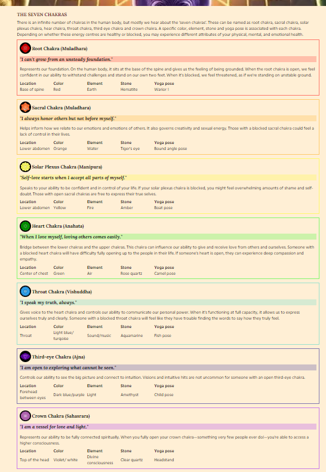  

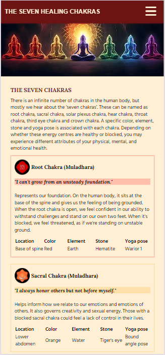  

#### **Hero image**

Seven chakras: Personally, this image was very appealing to me because of the colors. There is a bit of a yellow shade in the form of chakra coming from the back, which gave me the vibe of energy and power. The yellow color goes well with the theme. Further, in this image seven human postures can be seen in different colors. Each chakra has its own color and each posture represents one chakra. Throughout the page I have played with the same colors. This can be seen back in the small pictures, the mantra color and the border color.

  

### **Balancing chakras**

* The user can get inspired by the techniques used for balancing the chakras.
* The balancing page start with an introduction text to the page.
* The second section contains the eight techniques which can be used to balance the chakras.
* On larger devices techniques are divided in two columns. To do this the width of the text is set to 50%, otherwise the paragraph would cover too much space and it would not be possible to show two techniques in one row. On smaller devices it is shown as one column.
* Icons have been used from [fontawesome](https://fontawesome.com/) fo eacht technique. Icons are chosen based on the content of the technique This is done to make the information visually look better  

#### **Page images**

The page images for both desktop and mobile can be seen below.

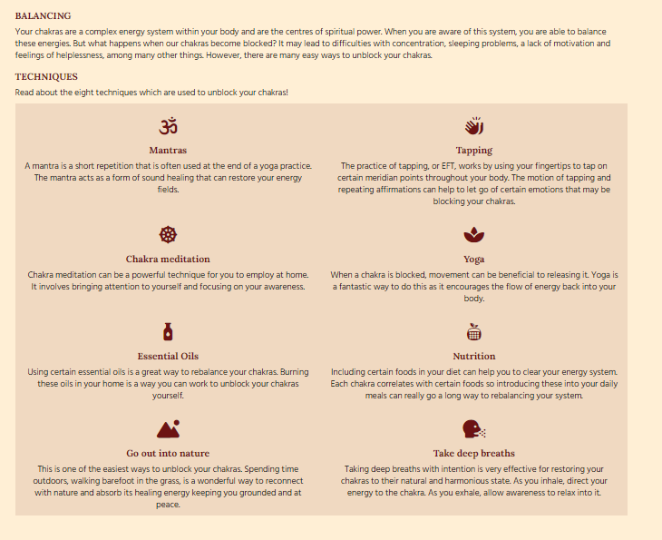  

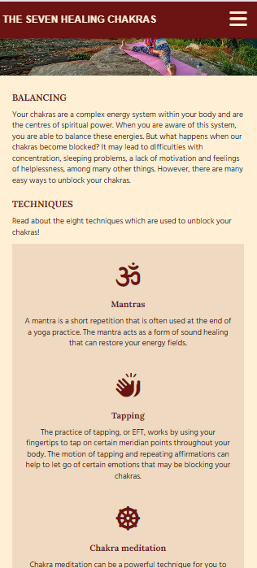  

#### **Hero image**

Balancing: For this hero image my motivation came from the techniques for balancing which are mentioned on the this page. I tried to find a good combination of the techniques and I came across an image of a person doing yoga in nature. I was not able to capture all eight in a picture, but this covered quite a few techniques: nature, yoga, meditation, breathing. The green color in the image gave a boost to the overal subtle contrast of the theme. Also, the picture had a very high quality and I loved the total effect it was creating.

  

### **Contact and contact feedback**

* Goal of the page is that the user can get an option to engage/ get in touch.
* Page includes a form with input fields, text area, select/dropdown and a button to submit the form. 
* The first four field are required and marked with a red asterisk. Clicking on submit with empty values will return in a message  to fill in these fields.
* The dropdown is optional and only one option can be chosen. The first value "Please select" is a disabled value and cannot be chosen.
* Upon submitting the form the user is navigated to a follow up page. For obvious reason this page is not shown in the navigation bar.
* The user get feedback when he/she can expect a response.
* A disclaimer has been added to make the user aware that the website is only for training purposes. This form is is just mimicking the process of filling in fields and submitting a form. 
* A button is present in the contact feedback page for the user to navigate back to the contact page.

#### **Page images**

The page images for both desktop and mobile can be seen below.

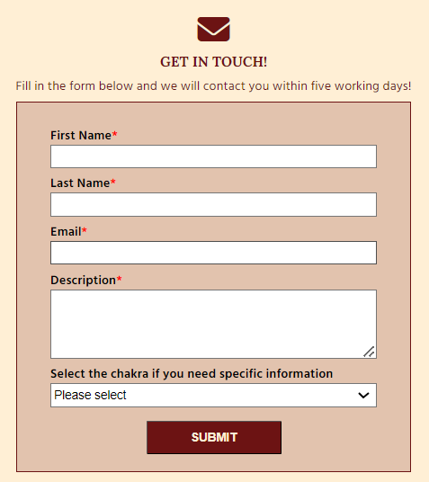  

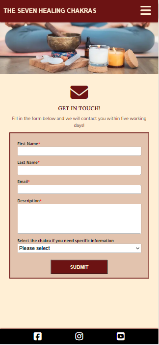  

Contact feedback images  

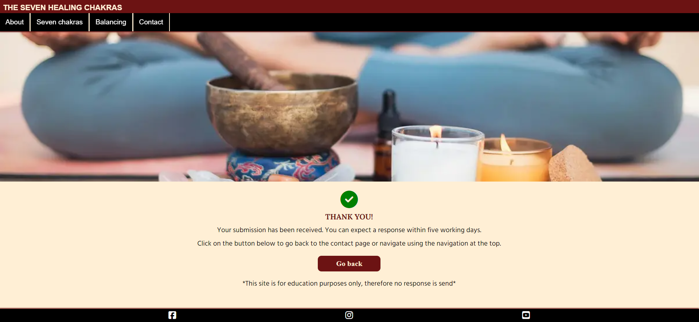  

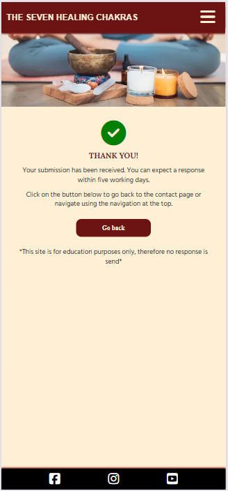  

#### **Hero image**

As the final page on the website, I wanted to go for a relaxing yet subtle image complimenting the look and feel of the website. The colors of the chosen image went well with the website and it acomplished my search for a calm image. The image represents candles, essential oils and nutrition as the foreground. With this it also covers the second part of the techniques on the balancing page.  

Contact feedback: The same image as the contact page has been chosen for this one. As the proces remains the same I wanted to keep the same image.

  

## **Testing results**  

The testing results can be found in a seperate file called: [TESTING.md](TESTING.md)  

## **Live site**  

Deployment steps have been followed as described in the love-running project. The live site can be found here: [Seven chakras live website](https://jsaprah.github.io/seven-healing-chakras/)  

## **Future enhancements** 

* As a starting point, the aim of creating this website was giving knowledge to user about the chakras. For the future, the main goal would remain the same.  
* Further enhancement on the balancing techniques. Such as:  
    * The users could be linked to nearby places where they can follow yoga/meditation classes  
    * Users can get advise on nutrition. Charts on what to eat for healthy options  
    * Users can get advise on essential oils. Which oil and where to buy.  
    * Extend the form to quizes so the user can answer some questions and get to know what chakra is impacting their lifestyle.
* Because of time constraints and with the reason of delivering a minimum viable product - this was not a requirement mentioned, I missed the opportunity to add videos and articles to the website. This would be a nice to have for in the future. With videos and articles the users would get more visual views about the chakras.  
* From technicial perspective I believe that I was able to put in lots of my knowledge that I have learnt over the past time with this course. Enhancing my knowledge with other programming languages and adding real actions, such as sending the form and saving the information to a database, would be the next step.  

## **Resources and credits**  

Read all about the resources used for this project.  

### **General reference:**
As a starting point I have been influenced by the project Love Running. Also, I used Google a lot to do research and find solutions. In my search, most of the time, I have used: 
 * [Stack overflow](https://try.stackoverflow.co/explore-teams?utm_source=adwords&utm_medium=ppc&utm_campaign=kb_teams_search_brand_emea-dach&_bt=657236278306&_bk=stack+overflow&_bm=p&_bn=g&gad_source=1&gclid=Cj0KCQjwiYOxBhC5ARIsAIvdH50YnE8hJzDHtOct-eti_TfrOjk82UP7kzwKMWd1EUeEio4oKg1mnjoaAoNgEALw_wcB)  
 * [W3schools](https://www.w3schools.com/css/css_navbar_horizontal.asp)  

### **Media**  

* Color grid: [Contrast grid](https://contrast-grid.eightshapes.com/)  
* Fonts: [Google fonts](https://fonts.google.com/)  
* Help with selecting the font: [Joyfont](https://fontjoy.com/)  
* Icons: [FontAwesome](https://fontawesome.com/)  
* Images: [Pexels](https://www.pexels.com/)  
* Formatting images to webp: [Ezgif](https://ezgif.com/png-to-webp)  
* Compressing images: [RedKetchup](https://redketchup.io/image-compressor)  

### **Content** 

The content is not written by myself as I wanted to focus on the coding part. The following websites were used for the content. 
* Seven chakras page: [Hands on health](http://www.handsonhealthsheffield.com/health/the-seven-chakras-for-beginners/#:~:text=Root%20Chakra%20(Muladhara)&text=When%20the%20root%20chakra%20is,re%20standing%20on%20unstable%20ground.&text=Mantra%3A%20%E2%80%9CI%20can't,grow%20from%20an%20unsteady%20foundation.%E2%80%9D)  
* Balancing page: [Pen pen wellness](https://www.penpenwellness.com/post/8-easy-techniques-you-can-do-at-home-to-unblock-chakras)  
* About page: [Webmd](https://www.webmd.com/balance/what-are-chakras)  
* Other:
    * [Healtline](https://www.healthline.com/)  
    * [Mind body green](https://www.mindbodygreen.com/articles/7-chakras-for-beginners)  

### **Testing**  

* Wave: [Wave](https://wave.webaim.org/help)  
* W3C: [W3C](https://validator.w3.org/)  
* Lighthouse: via developers tools.  