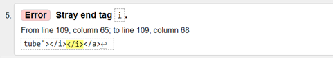
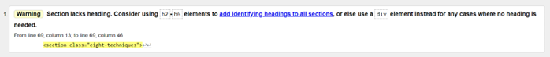

# **The seven chakras Testing**

## **Testing methods**

Several methods have been used for continuous improvement during the project as well as test post finishing the project. The first part of this document covers the issues faced and solved during the project. The second part is about the testing after.

## **Manual testing**

The following manual methods were used for testing:

1. Testing by changing the code in GitPod and viewing the output on port 8000. I continously checked this on the responsiveness and made media queries where needed. I made changes in the "inspect" part just to see what impact my changes would have and to find any issues. For example a part of my screen was showing blank and the main part was not getting covered by it. By using the inspect option I came to know what was causing this issue. Also, below the footer there were some additional quotes which did allow the footer to align to the bottom. I managed to get both of these issues resolved.
2. Deployed the website via GitHub and checked how the website would look here. From here I discovered that not all images were showing which were visible on the testing website. The reason for this was that I used absolute values instead of relative values.
3. Checked the website several browsers e.g. Internet Explorer, Chrome and Microsoft Edge. This did not cause any issues. No issues were found here.
4. Shared the URL with my family so they could have a look at their devices and see if everything is readable and showing up correctly. No issues were found here.
5. Mentor session with David on 9 April, 14 April and 17 April. I kept a log with all my questions and all improvement points mentioned in the meetings. The points that came out of the meeting are as following:

| Date         |Feedback type|Description  |
| -------------|-------------|-------------|
|09/04-2024   | Improvement | Use color codes instead of color names as the names are not supported in all browsers.|
| 09/04-2024   | Improvement | Instead of br create a class with the padding styling and use this throughout the code in HTML.|
| 09/04-2024   | Improvement | While committing don’t use the past time, instead write the code down as an instruction.|
| 09/04-2024   | Error       | Error on empty hamburger label. Add a class sr in a span in the label. Add styling to the css file for this class. Code shared by mentor.|
| 14/04-2024   | Error       | Error for label without content. Reason for this was not mentioning the ID in the input fields. By adding the ID’s in the input fields with the same text as the for tag in the label I was able to solve this issue.|
| 14/04-2024   | Improvement | Change the image to webp format and make two sizes of each image for smaller and larger devices  |
| 14/04-2024   | Error       | Images visible in the testing environment, but not on the deployed website. Solved this by making the path relative instead of absolute by adding. |
| 14/04-2024   | Error       | Table taking too much space on smaller screens. Solved this by adding a media query for smaller screens and reversing the table vertically. |
| 14/04-2024   | Improvement | When submit form I was using a post method. Mentor suggested me a different approach and sending the user to a different page on the same website. Implemented the changes. |

## **Testing with validators**

For this part the following validators were used:
1. WAVE - Web Accesibility Evaluation Tools - https://wave.webaim.org/
2. W3C - Markup Validation Service - https://validator.w3.org/
3. Lighthouse - via Developers Tools

### **Wave**

This resulted in 5 errors which were fixed:

- Error on empty hamburger label. Add a class sr in a span in the label. Add styling to the css file for this class. Code shared by mentor.
- Four errors for label without content. Reason for this was not mentioning the ID in the input fields. By adding the ID’s in the input fields with the same text as the for tag in the label I was able to solve this issue.

### **W3C**

Two errors, two sub-errors and one warning was found using this validator:

1. 
Issue: Stylsheet tag
Place: On all pages.
Description: 
Issues with the stylsheet tag which caused three errors. I mentioned the tags stylesheet in. The stylesheet tags are used when you want the styling content in the HTML file. This would go above the body element. In this case I have a separate file for css. Removing the stylesheet tags made the three errors dissapear.

This caused in total three errors.

Error image: 

2. 
Issue: Closing tag for icon
Place: On all pages.
Description: 
There was an additional closing tag in the Youtube icon. I deleted this tag and the error was solved.

Error image:

3. 
Issue: Section without header
Place: Balancing page.
Description: 
Warning of a section without header. After double checking this it was on the class “eight techniques” which covers the eight methods. As this element does not need any headings and was only meant to divide the content I changed the section tags to div tags. This solved the problem.

